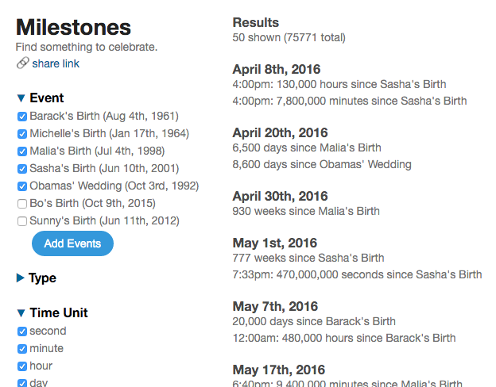

# Milestones
You probably don't have a birthday this week, but maybe you're turning *one billion* seconds old. Isn't that worth celebrating?

Or maybe it's your 12,345 month anniversary?

Or your house is 22,222 days old?

Milestones helps you find reasons to celebrate. It searches tons of combinations of time units and numbers and shows you interesting things that are coming up. Sometimes there are dozens in the next week.

## Tips
Milestones works best if you enter a bunch of dates you care about. Try birthdays, dating/wedding anniversaries, pet birthdays, moving days and other life events.

Here's an example:

[load this example] (http://wmatthew.github.io/milestones/?events=Barack%27s_Birth=1961-08-04;Michelle%27s_Birth=1964-01-17;Malia%27s_Birth=1998-07-04;Sasha%27s_Birth=2001-06-10;Obamas%27_Wedding=1992-10-03;Bo%27s_Birth=2015-10-09;Sunny%27s_Birth=2012-06-11)
